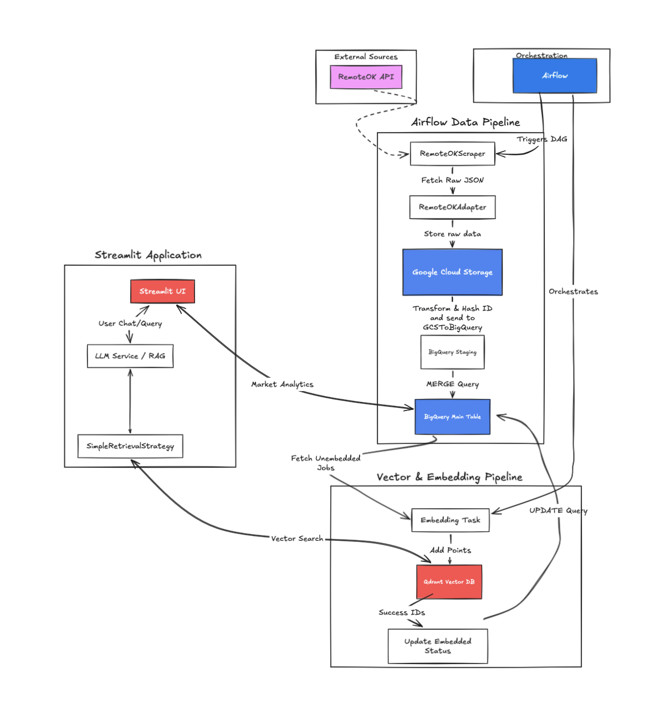

<h1 align="center">JobPulse</h1>
AI-powered job search assistant using RAG to help find relevant job postings.

Check out [demo](https://nakornb-jobpulse.streamlit.app/) here!

## ⚒️ Tech Stack
- **Prefect**: Workflow orchestration
- **Postgres**: Job database
- **Qdrant**: Vector database
- **Langchain**: RAG orchestration
- **HuggingFace**: Embeddings & LLM inference
- **Streamlit**: RAG chat interface

## 🏗️ Architecture


## 💻 Installation

### 1. Set environment variables
```bash 
cp .env.example .env
# Start services
docker compose up -d
```
### 2.  Run Application locally
It's recommended to run the Streamlit app outside Docker for faster reloads in development
```
# Install dependencies
uv sync # or pip install -r requirements.txt
# Run Streamlit
streamlit run src/app/ui/streamlit_app.py
```
### 3. Run the pipeline
The daily pipeline (RemoteOK → Postgres → Qdrant) is a Prefect flow in `src/app/flows/`.
```
# Run once locally
uv run python src/app/flows/daily_job_scraper.py

# Or deploy on a daily schedule (see prefect.yaml)
prefect work-pool create jobpulse-pool --type process
prefect deploy --all
uv run prefect worker start --pool jobpulse-pool
```

## Author
Nakorn Boonprasong \
Linkedln: https://www.linkedin.com/in/nakornb/ \
Email: boonprasonganakorn@gmail.com